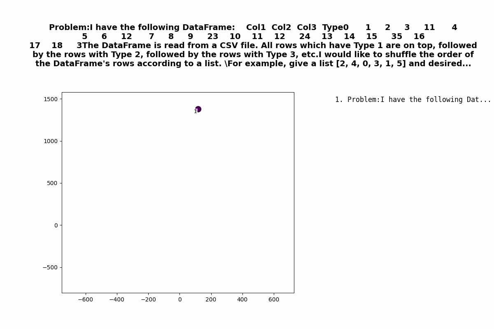
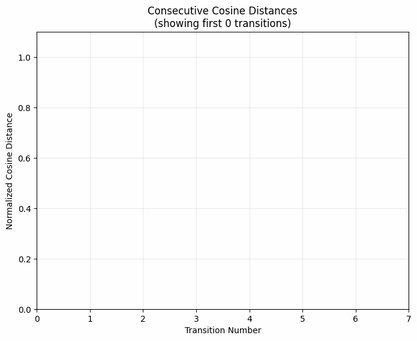
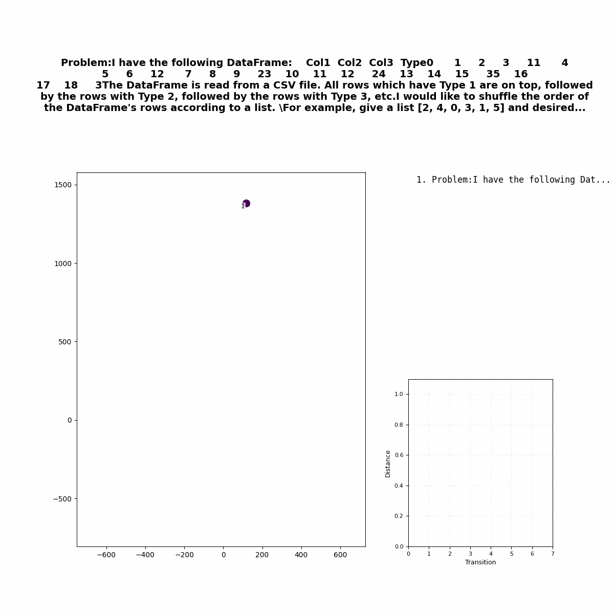

# CodeGenTrace
Visualizing AI Code Generation Trace: A t-SNE-Based Approach to Uncover the Thought Process of Language Models

# Frames of Mind: Animating R1's Thoughts

We can visualize the "thought process" for R1 by:

- Saving the chains of thought as text
- Converting the text to embeddings with the OpenAI API
- Plotting the embeddings sequentially with t-SNE

Here's what it looks like when R1 answers a question :
| |
|---------|
|  |

## Consecutive Distance

It might be useful to get a sense of how big each jump from "thought i" to "thought i+1" is. The graph below shows the difference between consecutive steps.

| |
|---------|
|  |

By default we calculate cosine similarity between the embeddings and normalize across the set of all consecutive steps to 0, 1. I'm interested in seeing when the bigger or smaller jumps happen in the "thought cycle".

## Combined Plot

| |
|---------|
|  |

## Usage

I used these prompts:

1. Implement a binary tree data structure with basic operations
2. Design a new caching system architecture
3. Explain and implement the Decorator pattern
4. How do you balance code performance with readability?
5. How would you resolve a conflict between two competing design patterns?
6. What makes a good code architecture?
7. What optimizations would you make if system concurrency suddenly doubled?
8. What's the best way to handle exceptions and error cases?
9. Why do we need to write unit tests?
10. Why do developers use design patterns?

The chains are available in data/chains. To easily pull from Deepseek's public chat interface, paste the "pull_cot.js" script into your browser console when a chat is open. It will download automatically.

Install requisite packages in Pipfile and run with the function in run.py.